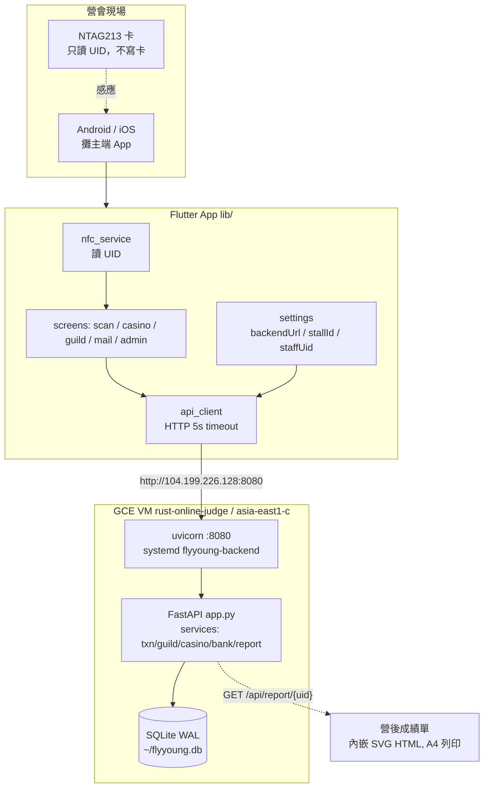
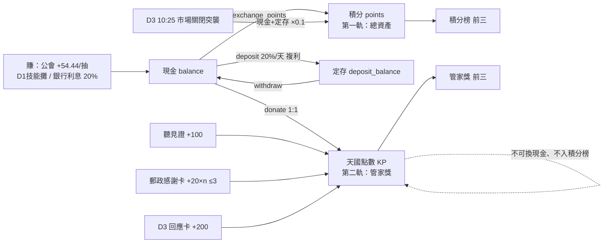
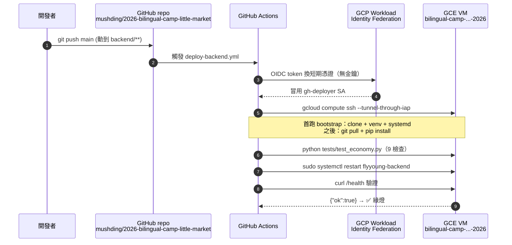
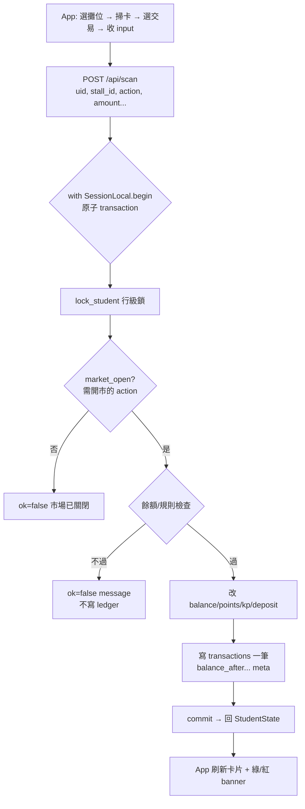
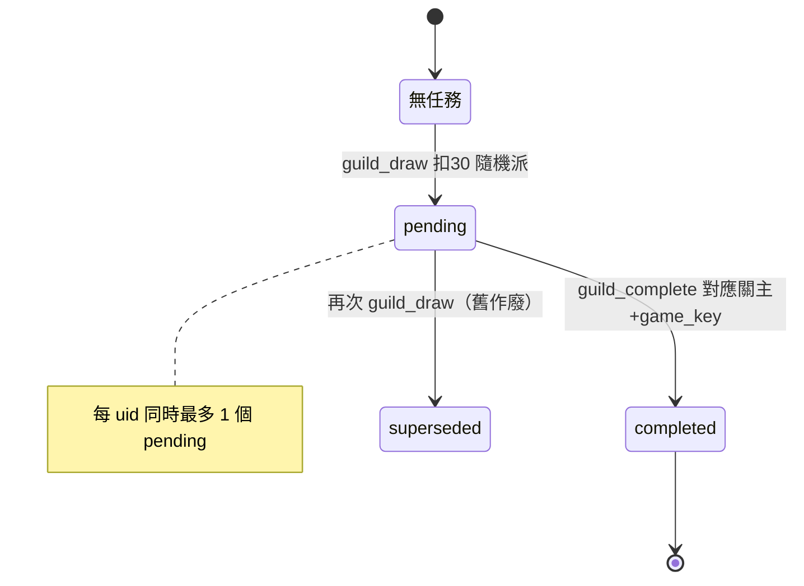
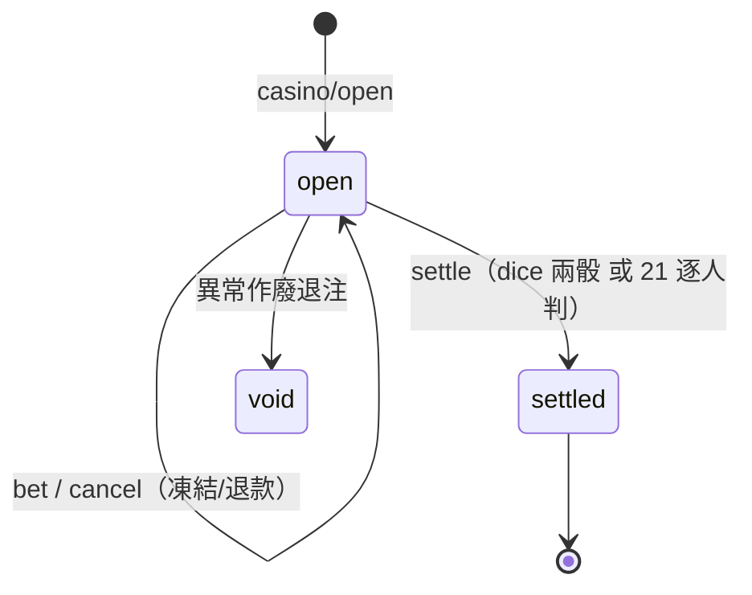

# 系統架構與部署（docs as code）

> 給未來 session / 接手同工的技術全貌。圖用 Mermaid（GitHub 直接渲染）。
> 對應實作：`lib/`（App）、`backend/`（FastAPI）、`.github/workflows/`（CICD）。
> 所有遊戲數字以 SOT v1.0 為準（見 `docs/01`、`docs/app/31`、`docs/app/32`）。

---

## 1. 系統架構



**設計原則**：App 不算錢、不存 state。每次操作 = 一次 round-trip，後端 UID-lookup
→ 原子交易 → 回新餘額。卡片不寫入，換手機/重感應無影響（state 全在 DB）。

---

## 2. 雙軌結算（信息核心）



> 張力：總資產第一 ≠ 神眼中贏家。兩軌互不換算，刻意讓不同的人上榜。

---

## 3. CICD / 部署流程（已上線）



**為何這樣選**：
- **WIF（無金鑰）** > service-account JSON 金鑰：不會外洩、不用輪替。
- **IAP 隧道 SSH** > 公開 22 port：VM 不暴露 SSH 給全世界。
- **systemd**：開機自啟 + 崩潰自動重啟。SQLite 存 VM 磁碟（持久，不像 Cloud Run）。

---

## 4. 單筆交易請求流（POST /api/scan）



> 業務錯誤（餘額不足等）= HTTP 200 + `ok=false` + `message`；4xx/5xx 只給系統錯誤。
> 防併發：`with_for_update` 鎖學生列，賭場/公會同卡序列化，杜絕雙扣雙領。

---

## 5. 關鍵狀態機





---

## 6. 現行基礎設施（live facts）

| 項目 | 值 |
|---|---|
| GitHub repo | `mushding/2026-bilingual-camp-little-market` |
| GCP project | `rust-online-judge` |
| VM | `bilingual-camp-little-market-backend-2026`（asia-east1-c, e2-small）|
| Backend URL | `http://104.199.226.128:8080`（防火牆規則 `bilingual-camp` 已開 8080）|
| 外部 IP | **static** `104.199.226.128`（保留名 `flyyoung-ip`，asia-east1，綁 VM 不浮動）|
| 服務 | systemd `flyyoung-backend`（uvicorn :8080）|
| DB | SQLite `~/flyyoung.db`（VM 磁碟）|
| 部署 SA | `gh-deployer@rust-online-judge.iam.gserviceaccount.com` |
| WIF provider | `projects/10783187941/.../workloadIdentityPools/github-pool/providers/github-provider` |
| GitHub Secrets | `GCP_WIF_PROVIDER`, `GCP_SA_EMAIL` |
| GitHub Variables | `GCP_PROJECT_ID`, `GCP_ZONE`, `GCP_VM_NAME` |

部署設定步驟全文見 [`../../DEPLOY.md`](../../DEPLOY.md)。

---

## 7. 程式碼地圖

```
lib/
  main.dart              App 入口
  models/                StudentState, TxnType
  data/stalls.dart       攤位→允許交易（stall_id 清單）
  services/              nfc / api_client / settings
  screens/               scan(主) / settings / casino / guild / mail / admin
  widgets/               student_card / amount_input / exchange_picker
backend/
  app.py                 所有 endpoint（scan/guild/casino/admin/report）
  constants.py           SOT 數字唯一來源（改數字只動這）
  models.py              ORM（docs/app/32 schema）
  services/txn.py        金流核心 handle_scan（15 actions）
  services/{guild,casino,bank,report}.py
  seed_import.py         營前 CSV 建表
  tests/test_economy.py  9 項經濟自我檢查
.github/workflows/deploy-backend.yml   CICD
```
